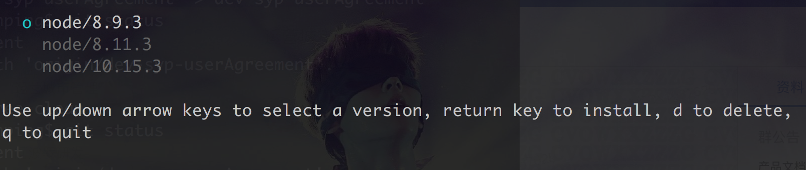

### 管理 node 版本
不同项目使用的 node 版本不一样，这时候你需要一个插件来管理 node 版本，根据不同项目灵活切换 node 版本。
我自己在用 n 来管理 node 版本，原因就是它使用起来特别简单。
- 第一步，安装 n  
$ `npm i n`
- 第二步，安装你需要的 node 版本  
$ `n node版本号`
- 第三步，根据不同的项目切换 node 版本  
$ `n` 

选择当前项目需要的版本回车即可。  
